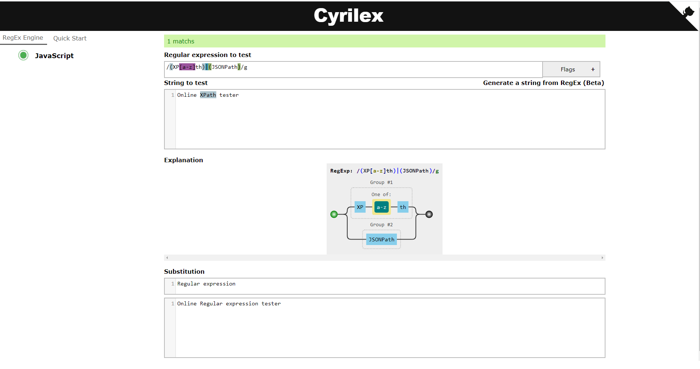

# Cyrilex 

Cyrilex is a visual regex tester.

Try the demo here: [https://extendsclass.com/regex-tester.html](https://extendsclass.com/regex-tester.html)

## Dependencies 

This tool uses:
 * [codeMirror](https://github.com/codemirror/CodeMirror) (MIT license)
 * [regulex](https://github.com/CJex/regulex) (MIT license) 
 * [randexp.js](https://github.com/fent/randexp.js?) (MIT license)
 * [github corners](https://github.com/tholman/github-corners) (MIT license)

## Install

Drop the files into a directory (on a server or on your PC) and then visit in a browser. 

## Launch tests

Not implemented yet.

## License

MIT
